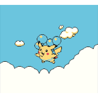

<table>
<tr>

<td width="70%" valign="top">

<h1>Hi 👋 I'm Sumedh Singh Gautam</h1>

<h3>
Computer Science Student • AI Developer • Data Science Enthusiast
</h3>

<p>
Building AI products one commit at a time.
</p>

<br>


</td>

<td width="30%" align="right" valign="top">



</td>

</tr>
</table>

---
## 🚀 About Me

- 🎓 B.Tech CSE @ VIT-AP
- 🤖 Building AI-powered applications
- 📊 Machine Learning & Data Science
- 🌐 Full Stack Development
- 🐧 Linux Enthusiast
- 🚀 Exploring Agentic AI & MCP

---

## 💻 Tech Stack

<p align="center">

</p>

---

## 🌐 Connect

<p align="center">
<a href="https://www.linkedin.com/in/sumedh-singh-gautam/" target="_blank"></a>
<a href="https://mail.google.com/mail/?view=cm&fs=1&to=sumedhsinghg@gmail.com"></a>
<a href="https://x.com/SumedhSGautam" target="_blank"></a>
<a href="https://discord.com/users/791216906467540992" target="_blank"></a>
</p>

---

<p align="center">

<picture>

<source
media="(prefers-color-scheme: dark)"
srcset="https://raw.githubusercontent.com/iamsumedhsg/iamsumedhsg/output/pacman-contribution-graph-dark.svg">

<source
media="(prefers-color-scheme: light)"
srcset="https://raw.githubusercontent.com/iamsumedhsg/iamsumedhsg/output/pacman-contribution-graph-light.svg">


</picture>

</p>

---

## 🌱 Current Focus

- 🤖 Building **LLM Arena**
- 📊 End-to-End Data Science Projects
- 🚀 Learning Agentic AI
- 🌍 Open Source Contributions
- 💻 Competitive Programming

---

## 📊 GitHub Stats

<p align="center">


</p>

<p align="center">


</p>

---

## 📈 Contribution Activity

[](https://github.com/ashutosh00710/github-readme-activity-graph)

---

## ⭐ Featured Projects

[](https://github.com/iamsumedhsg/LLM-Arena)

[](https://github.com/iamsumedhsg/Profile-Inspector)

---

<p align="center">

### 💭 Philosophy

```cpp
while(alive)
{
    learn();
    build();
    improve();
}
```

⭐ Thanks for visiting!

</p>

